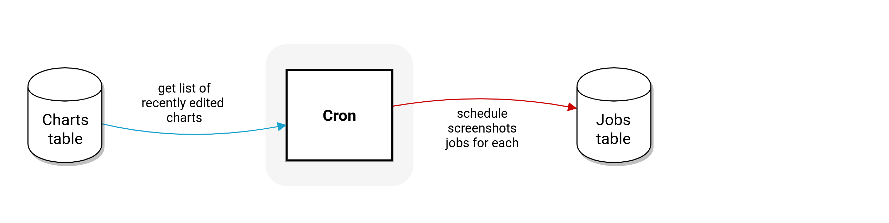

# datawrapper-crons
A collection of tasks that our server performs regularly in the background




### Installation

```sh
# create folder and copy config.js
mkdir /path/to/datawrapper-crons
cp /my/secret/config.js .
# install the API
npm init -y
npm install @datawrapper/crons
```

Then you can start the server using:

```sh
npm start
```

Or set up auto-restarting using `pm2` via

```sh
pm2 start 'npm start' --name=crons
```

To make sure the database is in sync after ORM updates, run:

```sh
npm run sync
```

### Screenshot scheduling

This app is responsible for scheduling the screenshots of recently edited charts every minute.

**S3 publishing:**

in `config.js`:

```js
module.exports = {
    frontend: {
        // domain name used to access charts
        domain: 'app.staging.datawrapper.de',
        https: true,
        screenshots: {
            // bucket and path to store screenshots in
            s3: {
                bucket: 'stg-datawrapper-charts',
                path: 'path/to/screenshots'
            },

            file: false,
            cloudflare: false
        }
    }
    // db etc
};
```

The crons app only creates the task data (which includes bucket name and path), but the actual writing to S3 is done by the **render-client**. So you need to make sure the render-client config has the AWS credentials needed to write to the specified bucket.

**Local file publishing:**

perfect for local developer setup. `config.js`:

```js
module.exports = {
    frontend: {
        // domain name used to access charts
        domain: 'app.datawrapper.local',
        https: false,
        screenshots: {
            file: {
                path: '/path/to/dw-docker/mounts/datawrapper/charts/static/preview'
            },
            s3: false,
            cloudflare: false
        }
    }
    // db etc
};
```
